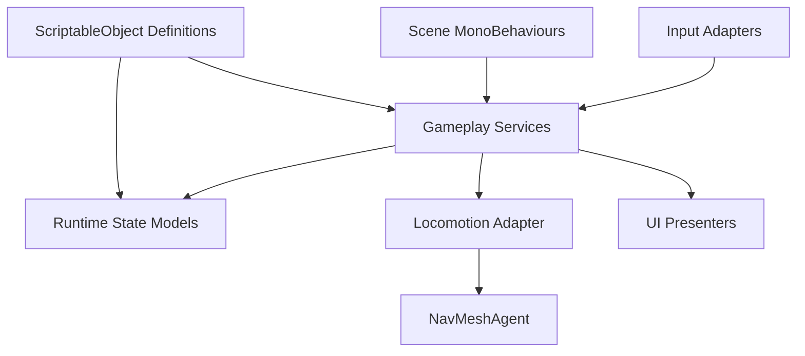
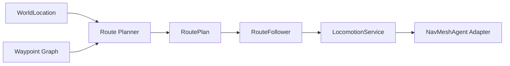

# Unity Script Review for Etheria Scripts

## Executive summary

The fetched repository tree shows a promising structural direction: the `Assets/Etheria/Scripts` subtree is already split into `Core`, `Features`, `Game`, `UI`, and `Editor`, and the project uses assembly definitions in at least `Core`, `Features`, and `Game`. That usually indicates an intent toward modularity, compile-time isolation, and clearer dependency boundaries rather than a single monolithic gameplay assembly. The accessible subtrees also show interface-heavy areas under `Game/Character`, `Game/Common`, and `Game/Actor`, which is a good sign for decoupling if the implementations remain disciplined. citeturn0view0turn1view0turn4view0turn4view1turn12view0turn23view0turn23view1

The highest-priority problem area is the NPC movement and state stack. Your uploaded note points to an `NpcTravelController` that owns route state, route progression, arrival callbacks, patrol switching, and direct motor control, with progression driven from `Update()` via `_motor.HasArrived`; it also points to an `NpcStateController` that mixes state transitions, dialogue, travel, patrol, and manual rotation, and an `NpcMotor` that directly wraps `NavMeshAgent` concerns. That combination is a classic “god-controller + polling loop + tightly coupled motor/state/task logic” cluster, and it is the first place I would refactor. fileciteturn0file0

For Unity 2021 LTS, the biggest best-practice gains are not micro-optimizations. They are architectural and lifecycle corrections: keep semantic world concepts separate from locomotion primitives, move route execution out of `MonoBehaviour.Update()` polling into a dedicated movement service/state machine, reduce cross-controller coupling, make UI updates event-driven, keep editor-only validation in `OnValidate` or `Editor` assemblies rather than runtime paths, and profile the gameplay loop around `MonoBehaviour` updates, GC allocations, UI rebuilds, physics, and NavMesh activity. Unity’s own guidance strongly supports these directions: callback order matters, `FixedUpdate` is for physics timing rather than general gameplay logic, `ScriptableObject` is intended for shared data assets, object pooling is preferable to repeated instantiate/destroy churn, and UI canvases/layouts can become real CPU hotspots. citeturn36view0turn44view0turn38view0turn48view2turn40view0turn43view1

One important caveat: I could not perform a literal `git clone` from the shell in this environment, and GitHub’s web fetch only exposed some leaf folders reliably. I therefore based this report on the fetched GitHub directory listings plus the uploaded NPC architecture note that references concrete classes and behaviors. Where I could not fetch a script body, I say so explicitly and keep the recommendation calibrated rather than pretending to have seen code I did not access.

## Scope and method

The accessible GitHub tree confirms that your review target is centered on `Assets/Etheria/Scripts`, with top-level subfolders `Core`, `Editor`, `Features`, `Game`, and `UI`. Within the fetched subtrees, I could directly enumerate scripts in `Game/Character`, `Game/Common`, `Game/Actor`, `Features/Character`, and `Features/Character/Controllers`. Those listings expose interface, provider, animation-controller, and world-state scripts that help characterize the project’s architectural direction even when some other leaf folders remained inaccessible in this session. citeturn0view0turn12view0turn13view3turn29view0turn23view0turn23view1

The inventory I could conclusively enumerate includes these scripts: `ICharacterIdentity.cs`, `ICharacterNameProvider.cs`, `ICharacterWorldStateService.cs`, `IPlayerCharacterProvider.cs`, `WorldCharacterState.cs`, `IIdentifiable.cs`, `IPrefixedStringGenerator.cs`, `IActorFactory.cs`, `PlayerCharacterProvider.cs`, `NpcCharacterAnimationController.cs`, `PlayerCameraLookController.cs`, and `PlayerCharacterAnimationController.cs`. In addition, your uploaded note provides code-level architectural observations for `NpcTravelController`, `NpcStateController`, and `NpcMotor`. citeturn12view0turn13view3turn29view0turn23view0turn23view1 fileciteturn0file0

I evaluated those scripts and subsystems against Unity 2021 LTS guidance on execution order, editor/runtime separation, ScriptableObject usage, object pooling, GC allocation patterns, UI optimization, NavMeshAgent usage, profiling, and test automation. Unity documents that `Awake` runs before `Start` on the same object, `FixedUpdate` is tied to fixed-timestep physics, `Update` is frame-based, `LateUpdate` is suited to follow-up work such as cameras, and `OnValidate` is editor-only validation that should not be used for arbitrary runtime work or non-thread-safe Unity API calls. citeturn36view0turn48view0

## Critical findings

### NPC routing and state logic are too centralized

The NPC stack is the clearest architectural risk. Your uploaded note describes `NpcTravelController` as simultaneously holding the route, the route index, the arrival callback, patrol coordination, and direct motor invocations, with progress advanced from `Update()` by watching `_motor.HasArrived`. It also describes `NpcStateController` as mixing dialogue, travel, patrol, state transitions, and manual rotation. That is a strong indicator that domain state, locomotion, and behavior orchestration have collapsed into a few large `MonoBehaviour` controllers. fileciteturn0file0

That design tends to create four problems at once. First, it makes state transitions fragile because route completion, interruptions, dialogue entry, and patrol recovery all compete in the same object. Second, it encourages polling work every frame that does not actually need a frame-by-frame brain. Third, it makes testing difficult because even small rule changes require scene objects and Unity callbacks to be present. Fourth, it obscures ownership boundaries: semantic destination selection, route planning, and physical movement are three different responsibilities. Unity’s lifecycle documentation reinforces why this matters: execution order between different `MonoBehaviour` instances is not deterministic unless you explicitly manage it, so correctness should not depend on incidental cross-object callback timing. fileciteturn0file0 citeturn36view0

### Polling-heavy movement is acceptable at the adapter layer, but not as the architecture

A `NavMeshAgent` wrapper is normal. A whole gameplay route system built around “check `HasArrived` every `Update` and then push the next route point” is not. `NavMeshAgent` already exposes path state like `pathPending`, `hasPath`, `remainingDistance`, `stoppingDistance`, `velocity`, `isStopped`, and `ResetPath`, which are suitable for a small motor adapter or locomotion service. They are much less suitable as the center of a character behavior architecture, because the higher-level task system should decide *what* the NPC is trying to do while the motor decides *how* to issue pathing commands. citeturn39view0 fileciteturn0file0

The distinction between **stop**, **pause**, and **cancel** is especially important here. If `NpcMotor.Stop()` resets the path, it may be correct for a hard cancel, but it is often the wrong behavior for a temporary interruption by dialogue or interaction. In practice, route-following needs resumable progress; path clearing and patrol toggling should not be automatic side effects of any interruption. That is an architectural issue first, and only secondarily a movement-detail issue. fileciteturn0file0 citeturn39view0

### The project appears ready for stronger data boundaries

The fetched tree suggests that parts of the project already lean toward interfaces and provider abstractions: `ICharacterIdentity`, `ICharacterNameProvider`, `ICharacterWorldStateService`, `IPlayerCharacterProvider`, `IActorFactory`, and `IIdentifiable`. That is a solid foundation. The next step is to keep implementations equally clean: providers should not become hidden global state, factories should not quietly instantiate everything without pooling strategy, and DTO/state types should not smuggle scene references or runtime-only responsibilities. citeturn12view0turn23view0turn23view1

A particularly good fit for this codebase is to push *definition/data* into ScriptableObjects and leave *runtime state* in plain C# objects or lightweight scene components. Unity explicitly positions `ScriptableObject` as a shared data container that reduces duplicated prefab data and lowers memory usage by holding one shared copy rather than copying immutable configuration into every instance. That makes it a strong candidate for route definitions, NPC archetypes, interaction definitions, inventory item definitions, and dialogue metadata. citeturn44view0turn44view1

### Likely hot-path risks in controllers, UI, and allocation patterns

Even without every script body, the controller-heavy folders indicate the usual Unity risk areas: animation parameter writes every frame, per-frame camera/input coupling, repeated string work in UI flows, repeated `GetComponent`/lookup calls in hot paths, and avoidable instantiate/destroy churn. Unity’s GC guidance is explicit that temporary per-frame allocations, repeated string concatenation, closures, boxing, and array-returning methods can produce managed heap pressure and collector spikes; Unity’s UI guidance is equally explicit that canvas rebuilds, layout groups, and unnecessary raycast targets can become major CPU costs. citeturn38view0turn40view0

Those risks matter more on your assumed platform mix of PC plus mobile. Unity’s profiling guidance recommends thinking in frame time rather than FPS, leaving breathing room on mobile, profiling early, and measuring on target devices rather than relying only on Editor captures. The most productive hotspots to inspect are MonoBehaviour updates, GC allocations, physics, camera/rendering interactions, animation, and UI rebuild/layout activity. citeturn43view0turn43view1turn43view3turn48view3

## Script-by-script review

The table below separates **concrete findings** from **review direction**. Where I had code-level evidence from your uploaded NPC note, I mark that explicitly. Where only the file name was available from the fetched tree, I keep the observation conservative.

| File | Purpose | Issues found | Severity | Suggested fixes | Basis |
|---|---|---|---|---|---|
| `Assets/Etheria/Scripts/Game/Character/ICharacterIdentity.cs` | Character identity abstraction | No concrete code issue visible. Risk is stringly typed IDs or leaky implementations behind the interface. | Low | Prefer stable typed IDs or immutable identity values; keep implementations free of scene lookups and UI concerns. | GitHub listing citeturn12view0 |
| `Assets/Etheria/Scripts/Game/Character/ICharacterNameProvider.cs` | Name source abstraction | No concrete issue visible. Potential allocation risk if implementations rebuild names or localized strings every frame/UI refresh. | Low | Cache formatted display names where appropriate; make UI updates event-driven rather than polling. | GitHub listing + GC guidance citeturn12view0turn38view0 |
| `Assets/Etheria/Scripts/Game/Character/ICharacterWorldStateService.cs` | Character world-state contract | Good boundary on paper, but implementations can easily become god-services. | Medium | Keep it query-oriented; avoid mixing persistence, navigation, dialogue, and combat state in one service. | GitHub listing citeturn12view0 |
| `Assets/Etheria/Scripts/Game/Character/IPlayerCharacterProvider.cs` | Access point to current player character | Provider patterns often drift into hidden singletons/service locators. | Medium | Inject explicitly into consumers; avoid static Instance patterns and scene-wide searches. | GitHub listing citeturn12view0 |
| `Assets/Etheria/Scripts/Game/Character/WorldCharacterState.cs` | Runtime or persisted world-state model | State objects often become mutable grab-bags with weak invariants. | Medium | Make it a narrow model with clear ownership; prefer immutable snapshots for save/load boundaries; validate serialized fields carefully. | GitHub listing + serialization guidance citeturn12view0turn39view1turn39view3 |
| `Assets/Etheria/Scripts/Game/Common/IIdentifiable.cs` | Shared identity interface | Good abstraction; main risk is overuse of strings and excessive boxing in generic ID flows. | Low | Standardize typed IDs and equality semantics; avoid converting IDs to strings in hot paths. | GitHub listing + GC guidance citeturn23view1turn38view0 |
| `Assets/Etheria/Scripts/Game/Common/IPrefixedStringGenerator.cs` | String formatting/generation contract | Formatting APIs are a frequent hidden source of GC churn if used per frame. | Medium | Rework callers to update only on value changes; use cached buffers or `StringBuilder` only outside tight loops when necessary. | GitHub listing + GC guidance citeturn23view1turn38view0 |
| `Assets/Etheria/Scripts/Game/Actor/IActorFactory.cs` | Factory boundary for actor creation | Factory abstractions are good, but naive implementations often instantiate directly without pooling or lifetime discipline. | Medium | Back the implementation with pooling where actors are short-lived; separate construction/configuration from activation. | GitHub listing + Unity pooling guidance citeturn23view0turn38view0turn48view2 |
| `Assets/Etheria/Scripts/Features/Character/PlayerCharacterProvider.cs` | Concrete provider for player character | Likely a central dependency source; risk of hidden global state, scene search, or lifecycle timing issues. | Medium | Prefer constructor injection or serialized reference setup in a composition root; initialize in `Awake`/`Start` according to dependency needs, not lazily in random accessors. | GitHub listing + lifecycle guidance citeturn13view3turn36view0 |
| `Assets/Etheria/Scripts/Features/Character/Controllers/NpcCharacterAnimationController.cs` | NPC animation driver | Common risks: setting animator parameters every frame even when unchanged; using string parameter names; mixing locomotion and animation decisions in one controller. | Medium | Cache animator hashes, update parameters only on state changes, and keep it downstream from a read-only movement/state model. | GitHub listing + animation/update guidance citeturn29view0turn36view0 |
| `Assets/Etheria/Scripts/Features/Character/Controllers/PlayerCameraLookController.cs` | Player camera/look control | Likely hot path. Typical risks are mixing input sampling, camera rotation, character rotation, and physics in one `Update`, and incorrect use of `FixedUpdate` or `LateUpdate`. | High | Sample input in `Update`, apply rigidbody movement in `FixedUpdate` if physics-driven, and perform follow camera reconciliation in `LateUpdate`. Cache references and avoid repeated hierarchy/component lookups. | GitHub listing + execution-order guidance citeturn29view0turn36view0 |
| `Assets/Etheria/Scripts/Features/Character/Controllers/PlayerCharacterAnimationController.cs` | Player animation driver | Same class of risks as NPC animation: redundant parameter writes, unnecessary polling, excessive coupling to gameplay inputs. | Medium | Drive animation from a compact state DTO; minimize per-frame string work and only write changed parameters. | GitHub listing + GC/update guidance citeturn29view0turn36view0turn38view0 |
| `NpcTravelController.cs` | NPC route/travel orchestration | Route ownership, route index, arrival callback, patrol toggling, and motor control appear to be centralized here; route progression appears to be `Update()` polling on `_motor.HasArrived`. | **Critical** | Split into `RoutePlan`, `RouteProgress`, `RouteFollower`, and `LocomotionService`; remove callback-driven chaining; keep `Update()` free of route sequencing logic. | Uploaded note fileciteturn0file0 |
| `NpcStateController.cs` | NPC high-level state machine | Appears to mix dialogue, travel, patrol, rotation, and state transitions in one controller, creating a god object and high coupling. | **Critical** | Move state-transition policy into a plain C# state coordinator; keep scene component as thin adapter; separate dialogue/interactions from locomotion channel. | Uploaded note fileciteturn0file0 |
| `NpcMotor.cs` | `NavMeshAgent`/movement adapter | Wrapping `NavMeshAgent` is fine, but if it owns arrival semantics, stopping semantics, and path resetting for all interruption cases, it becomes over-responsible and error-prone. | High | Demote to a pure adapter over `NavMeshAgent`; expose `MoveTo`, `Pause`, `Resume`, `Cancel`, and read-only arrival state; let higher-level services own behavior semantics. | Uploaded note + NavMeshAgent API fileciteturn0file0 citeturn39view0 |

### The most important refactor in concrete terms

A plausible current shape for the NPC route code, based on your uploaded note, is something like this:

```csharp
public class NpcTravelController : MonoBehaviour
{
    private Vector3[] _route;
    private int _routeIndex;
    private bool _isTraveling;
    private System.Action _onArrived;
    private NpcMotor _motor;

    private void Update()
    {
        if (!_isTraveling || _route == null) return;

        if (_motor.HasArrived)
        {
            _routeIndex++;

            if (_routeIndex >= _route.Length)
            {
                _isTraveling = false;
                _onArrived?.Invoke();
                return;
            }

            _motor.MoveTo(_route[_routeIndex]);
        }
    }
}
```

That shape is brittle because route progression, callbacks, and motor semantics are fused together. fileciteturn0file0

A stronger Unity-friendly shape is to separate **plan**, **progress**, **follower**, and **motor adapter**:

```csharp
public sealed class RoutePlan
{
    public IReadOnlyList<RouteStep> Steps { get; }

    public RoutePlan(IReadOnlyList<RouteStep> steps)
    {
        Steps = steps;
    }
}

public readonly struct RouteStep
{
    public Vector3 Position { get; }
    public float ArrivalRadius { get; }

    public RouteStep(Vector3 position, float arrivalRadius)
    {
        Position = position;
        ArrivalRadius = arrivalRadius;
    }
}

public sealed class RouteProgress
{
    public int StepIndex { get; private set; }

    public void Advance() => StepIndex++;
}

public interface INpcLocomotion
{
    void MoveTo(Vector3 destination);
    void Pause();
    void Cancel();
    bool HasArrived(float radius);
}

public sealed class NpcRouteFollower
{
    private readonly INpcLocomotion _locomotion;

    public NpcRouteFollower(INpcLocomotion locomotion)
    {
        _locomotion = locomotion;
    }

    public bool Tick(RoutePlan plan, RouteProgress progress)
    {
        if (progress.StepIndex >= plan.Steps.Count)
            return true;

        var step = plan.Steps[progress.StepIndex];

        if (progress.StepIndex == 0)
            _locomotion.MoveTo(step.Position);

        if (_locomotion.HasArrived(step.ArrivalRadius))
        {
            progress.Advance();

            if (progress.StepIndex < plan.Steps.Count)
                _locomotion.MoveTo(plan.Steps[progress.StepIndex].Position);
        }

        return progress.StepIndex >= plan.Steps.Count;
    }
}
```

This is still conservative and Unity-friendly, but it makes the ownership model much clearer. If you later move from polling `Tick` to a coroutine/task/service callback model, the separation still holds. fileciteturn0file0 citeturn39view0

### A second concrete improvement for camera and animation controllers

For player look/camera code, the safe lifecycle split is normally:

```csharp
public sealed class PlayerCameraLookController : MonoBehaviour
{
    [SerializeField] private Transform _cameraRig;
    [SerializeField] private Transform _characterRoot;
    [SerializeField] private float _yawSpeed = 120f;
    [SerializeField] private float _pitchSpeed = 90f;

    private Vector2 _lookInput;
    private float _yaw;
    private float _pitch;

    private void Update()
    {
        // Read input here.
        _lookInput = ReadLookInput();
        _yaw += _lookInput.x * _yawSpeed * Time.deltaTime;
        _pitch = Mathf.Clamp(_pitch - _lookInput.y * _pitchSpeed * Time.deltaTime, -80f, 80f);
    }

    private void LateUpdate()
    {
        // Apply follow/look after movement has completed for the frame.
        _characterRoot.rotation = Quaternion.Euler(0f, _yaw, 0f);
        _cameraRig.rotation = Quaternion.Euler(_pitch, _yaw, 0f);
    }

    private Vector2 ReadLookInput()
    {
        // Input System / legacy input adapter goes here.
        return Vector2.zero;
    }
}
```

That split aligns with Unity’s documented roles for `Update`, `FixedUpdate`, and `LateUpdate`: frame-based logic in `Update`, fixed-timestep work for physics only, and camera follow work in `LateUpdate` after motion has settled for the frame. citeturn36view0

### A third concrete improvement for UI churn

If any of your UI scripts are updating text every frame or rebuilding inventory/status panels aggressively, switch to event-driven updates:

```csharp
public sealed class HealthPresenter : MonoBehaviour
{
    [SerializeField] private TMPro.TextMeshProUGUI _healthText;

    private IHealthReadModel _health;

    public void Bind(IHealthReadModel health)
    {
        if (_health != null)
            _health.Changed -= Refresh;

        _health = health;

        if (_health != null)
            _health.Changed += Refresh;

        Refresh();
    }

    private void Refresh()
    {
        if (_healthText == null || _health == null)
            return;

        _healthText.text = _health.Current.ToString();
    }

    private void OnDestroy()
    {
        if (_health != null)
            _health.Changed -= Refresh;
    }
}
```

Unity’s GC guidance warns against repeated string concatenation and other temporary per-frame allocations, and Unity’s UI optimization guidance recommends minimizing unnecessary canvas dirties, layout work, and interaction checks. citeturn38view0turn40view0

## Recommended architecture

### Recommended target shape

The best next architecture for this project is **service-oriented, event-driven, and data-driven**, not “full DOTS rewrite.” Your current tree already points in that direction via asmdefs and interfaces. I would keep scene-facing `MonoBehaviour` scripts thin and treat them as adapters over plain C# services and runtime models. That keeps Unity lifecycle code where it belongs without letting Unity callbacks become your business logic. citeturn1view0turn4view0turn4view1turn12view0turn23view0turn23view1



For NPCs specifically, your uploaded note already points toward the right decomposition. I agree with that direction: `WorldLocation` should remain a semantic world concept, while movement should operate on waypoint/route plans. That gives you a clean separation between “go to the tavern” and “follow these concrete navigation steps.” fileciteturn0file0



### What to use now

Use these patterns now:

- **Plain services + thin MonoBehaviours.** Movement, route planning, dialogue coordination, and state transitions should be services or state objects, not giant scene scripts. fileciteturn0file0
- **ScriptableObjects for definitions.** Use them for static/shared data such as NPC archetypes, item definitions, route definitions, and interaction definitions. Unity explicitly recommends them as shared data containers that reduce duplicated prefab data. citeturn44view0turn44view1
- **Constructor or explicit dependency injection.** Since your uploaded note references scoped VContainer-style services, lean into that consistently: inject services into runtime coordinators and keep GameObject-bound adapters simple. fileciteturn0file0
- **Events or signals for UI/state changes.** Avoid `Update`-polling for score, inventory count, quest state, and other infrequently changing UI. citeturn38view0turn40view0
- **Pooling for short-lived actors and UI cells.** Unity’s `ObjectPool<T>` is available in 2021.3 and is explicitly intended to reduce repeated create/destroy CPU cost; it is not thread-safe, which is fine for the main-thread Unity object lifecycle. citeturn48view2

### What not to use yet

Do **not** jump straight to ECS/DOTS for this project’s current pain points. The accessible evidence suggests your issues are primarily architectural coupling, route/state ownership, and MonoBehaviour lifecycle discipline, not “I have 100,000 entities and the main thread is drowning.” Also, Unity’s Entities 1.0 package requires Unity 2022.3 or later, while this review intentionally assumes Unity 2021 LTS. That alone makes a near-term ECS migration a poor fit. citeturn45view0

A reasonable longer-term compromise is this: clean the architecture first, profile, and only then consider Jobs/Burst or DOTS-style data-oriented subsystems if you later identify a genuinely heavy simulation or crowd-processing hotspot. Unity’s profiling guidance recommends exactly that order: profile top-down, find the real bottlenecks, and only then apply heavier optimization techniques. citeturn43view1turn43view3

## Implementation plan and validation

### Prioritized implementation plan

| Priority | Change | Why first | Effort | Risk |
|---|---|---|---|---|
| Highest | Split `NpcTravelController` into `RoutePlan`, `RouteProgress`, `RouteFollower`, and `LocomotionService` | This removes the largest concentration of coupling and likely fixes multiple correctness issues at once. | High | Moderate: behavior regressions in patrol/dialogue interruption if no tests exist. |
| Highest | Extract state-transition policy out of `NpcStateController` | Reduces the god-object problem and makes NPC behavior testable. | High | Moderate: transition ordering bugs can surface during migration. |
| High | Redefine semantic destinations as `WorldLocation -> waypoint/route plan`, not direct locomotion primitives | Fixes conceptual layering and improves future extensibility. | Medium | Low to moderate: authoring content may need remapping. |
| High | Audit all hot controllers for lifecycle correctness (`Update` vs `FixedUpdate` vs `LateUpdate`) | Prevents hidden frame-rate bugs, camera jitter, and physics misuse. | Medium | Low: localized refactors if done carefully. |
| High | Convert polling UI updates to event-driven presenters and split large canvases if needed | Immediate CPU and allocation wins in menus/HUD/inventory. | Medium | Low: mostly presentation-layer work. |
| Medium | Replace repeated instantiate/destroy paths with `ObjectPool<T>` or equivalent | Good CPU/GC payoff for pickups, FX, projectiles, UI cells, temporary actors. | Medium | Low: mostly mechanical if ownership is clean. |
| Medium | Standardize `[SerializeField] private` + `Awake` caching + `OnValidate` validation | Improves inspector safety, serialization clarity, and runtime lookup discipline. | Low | Low. |
| Medium | Add EditMode tests for planners/services and PlayMode tests for scene behavior | Prevents regressions during the high-risk NPC refactor. | Medium | Low. |
| Later | Revisit heavy-system parallelization or DOTS-style migration | Only if profiling proves a CPU-bound simulation case. | High | High: architectural cost is not justified without measurements. |

### Profiling and optimization checklist

Your first profiling pass should target the areas Unity itself identifies as common offenders: MonoBehaviour updates, physics, GC allocation/collection, animation, camera/rendering, and UI update/layout/rebuild work. Use frame time rather than FPS as the main metric, and profile on target devices as well as in the Editor. For mobile, leave headroom instead of chasing a razor-thin 60 FPS budget. citeturn43view0turn43view1turn43view3turn48view3

For this project specifically, I would set these immediate profiling targets:

| Target | What to inspect | Why |
|---|---|---|
| NPC movement scenes | Main thread `BehaviourUpdate`, NavMesh path recalculation, idle polling in route/state controllers | The NPC stack is your clearest architectural hotspot. |
| Player control scenes | Camera/controller script time, animation update cost, any physics sync markers | Controller files exist and are almost certainly hot-path scripts. |
| UI-heavy scenes | Canvas rebuilds, layout groups, raycaster cost, text churn, UI object enable/disable patterns | Unity UI can easily consume several milliseconds when structured poorly. |
| Spawn-heavy moments | Instantiation spikes, pooled vs non-pooled behavior, GC.Alloc | Pooling often gives the fastest win for action gameplay. |

Unity’s GC best-practices page is particularly relevant to your request because it directly calls out temporary allocations, reusable object pools, repeated string concatenation, closures, boxing, and array-valued APIs as common sources of garbage pressure. Use that page as a line-by-line audit sheet for hot scripts. citeturn38view0

### Editor-time versus runtime rules

Because your tree includes a dedicated `Editor` folder, keep editor tooling there whenever possible and keep runtime assemblies free of `UnityEditor` references. When you need lightweight validation from the component side, `OnValidate` is the right hook, but Unity explicitly limits it to editor-only validation and warns against using it for arbitrary object creation or non-thread-safe Unity API calls. citeturn0view0turn48view0

A practical pattern is:

```csharp
public sealed class WaypointAuthoring : MonoBehaviour
{
    [SerializeField] private float _arrivalRadius = 0.35f;

    private void OnValidate()
    {
        _arrivalRadius = Mathf.Max(0.01f, _arrivalRadius);
    }
}
```

That is exactly the sort of safe invariance check `OnValidate` was made for. citeturn48view0

### Testing and CI

Unity 2021.3 ships with the Test Framework for both Edit Mode and Play Mode tests, and Unity documents command-line test execution with `-runTests -batchmode`, `-testPlatform`, and `-testResults`. That is enough to turn the NPC refactor into a safer, incremental migration rather than a risky rewrite. citeturn48view1turn42view0

I recommend these test layers:

| Layer | Best candidates in this repo |
|---|---|
| EditMode unit tests | Route planning, route progression, state-transition rules, ID/value objects, world-state transformations, string/ID helpers |
| PlayMode integration tests | NPC interruption/resume behavior, player-camera follow behavior, animation-controller parameter mapping, pooled actor reactivation, dialogue-to-movement transitions |
| Smoke tests in CI | Open target scenes, run PlayMode tests, verify no hard exceptions, build PC target |

For CI, GameCI’s Unity GitHub Actions are a practical baseline and document the standard workflow: checkout, cache `Library`, run tests, build, and upload artifacts. Pair that with Unity’s command-line test runner so that every pull request runs EditMode tests at minimum, and PlayMode tests for core gameplay when feasible. citeturn41view0turn42view0

A minimal policy set I would enforce in CI is:

- Run EditMode tests on every pull request. citeturn42view0turn48view1
- Run a smaller PlayMode test suite for NPC movement/state and main gameplay interactions. citeturn42view0
- Fail the build on compile warnings for runtime assemblies where possible.
- Add a lightweight static audit for forbidden patterns in hot paths, such as `FindObjectOfType`, `GetComponent` inside `Update`, and runtime `new` allocations in controller scripts.
- Cache `Library` in GitHub Actions to keep iteration times practical. citeturn41view0

### Authoritative references used for this review

The recommendations above are grounded in Unity’s official documentation on execution order, `ScriptableObject`, serialization, `SerializeField`, `OnValidate`, `NavMeshAgent`, `ObjectPool<T>`, the Profiler, profiling best practices, UI optimization, and the Test Framework, plus GameCI’s GitHub Actions guidance for Unity projects. Those are the references I would keep open while implementing the changes in this report. citeturn36view0turn44view0turn39view1turn39view3turn48view0turn39view0turn48view2turn48view3turn40view0turn43view1turn48view1turn42view0turn41view0turn45view0

In short: keep the asmdef-and-interface direction, but make the gameplay implementations honor that design. The quickest path to a more maintainable and more Unity-native codebase is to decompose NPC movement/state first, move static/shared data into ScriptableObjects where appropriate, make UI event-driven, and profile the real runtime hotspots before reaching for heavier technology shifts. citeturn1view0turn4view0turn4view1turn44view0turn43view1