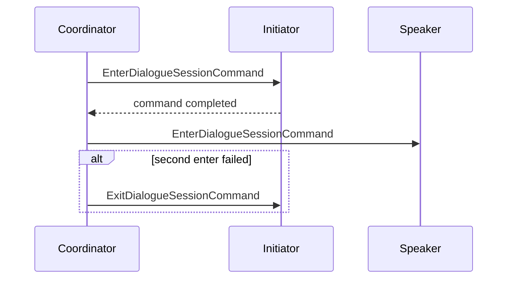
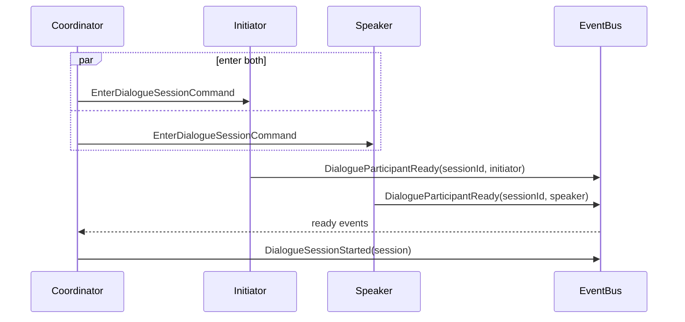
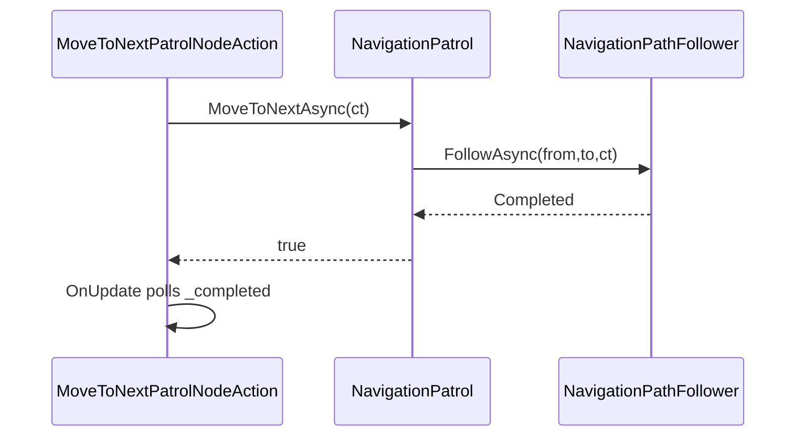

# Аналитический отчёт по внедрению EventBus в `rpg-microgame`

## Executive summary

В репозитории уже есть минимальная реализация `EventBus` в `Assets/Game/Scripts/Core/Runtime/Events`, но сейчас она используется скорее как заготовка и пример для UI, а не как системный механизм развязки между gameplay-подсистемами. API предельно маленький: `Publish<TEvent>` и `Subscribe<TEvent>(Action<TEvent>)`, хранение подписчиков идёт в `Dictionary<Type, List<Delegate>>`, публикация синхронная, а отписка реализована через `IDisposable`. Встроенной поддержки `async`-обработчиков, `CancellationToken`, weak subscriptions, приоритетов, фильтрации по actor instance, а также потокобезопасности у текущего класса нет. При этом в сопроводительном `event-system.md` уже зафиксирована желаемая модель: не `static singleton`, а scene/gameplay-scoped bus через VContainer `Lifetime.Scoped`. citeturn33view0turn33view1turn33view2turn33view3turn40view0

Главная архитектурная проблема не в том, что в проекте совсем нет событий, а в том, что они распределены неравномерно. Диалоговый вход и готовность участника сейчас уже моделируются как состояние, но ожидание завершения реализовано polling-механикой: `DialogueParticipantExecution` ждёт `UniTask.WaitUntil(...)` до готовности, `NavMeshNavigationModule` ждёт прибытие через `UniTask.WaitUntil(() => _planner.HasArrived)`, а UB-граф диалога держит `WaitForDialogueEndAction`, который на каждом `OnUpdate()` проверяет `Participation.Value.HasContext`. Патрульный action `MoveToNextPatrolNodeAction` тоже живёт в режиме «запусти async-задачу и каждый тик UB смотри, завершилась ли она». Это именно те места, где введение доменных событий даст максимальный эффект и минимальный риск. citeturn22view1turn27view5turn50view0turn47view6turn47view7

Практически полезная стратегия — не «переписать всё на event-driven сразу», а ввести события в трёх слоях. Во-первых, в gameplay-domain: `DialogueParticipantReady`, `DialogueParticipantExited`, `PatrolAdvanced`, `ActorSpawned`, `ActorDespawned`, `CommandAccepted`, `CommandCancelled`, `NavigationArrived`. Во-вторых, в bridge-слое к Unity Behavior: переводить доменные события либо в blackboard state, либо в Unity Behavior Event Channel message, в зависимости от того, нужен ли короткоживущий импульс или устойчивое состояние. В-третьих, в инфраструктуре: слегка расширить `EventBus`, не ломая текущее API, добавив `SubscribeOnce`, подписки с фильтром, scoped channels и `PublishAsync` как opt-in, а не как обязательную замену синхронной публикации. citeturn48search7turn48search20turn33view0turn40view0

Если делать приоритетно, то первый инкремент должен закрыть наиболее болезненный polling в диалоге: заменить `WaitUntilReady` на awaitable event, перевести `DialogueSessionCoordinator` на параллельный enter + ожидание двух ready-событий, а затем добавить мост в UB через blackboard/event-channel. Второй инкремент — события навигации и патруля. Третий — registry/spawn lifecycle. Четвёртый — команды и их интеграция с UB-driven поведением. Такой порядок даёт быстрый выигрыш в читаемости, развязке и тестируемости, при этом оставляя простой rollback: в каждом шаге можно оставить старый polling как fallback-флаг. citeturn23view3turn23view4turn47view4turn37view0turn40view0

## Что уже есть в репозитории

В `Core/Runtime/Events` уже лежит рабочая минимальная событийная инфраструктура: `EventBus.cs`, `IEventPublisher.cs`, `IEventSubscriber.cs`, `EventSubscription.cs` и пример `DialogueUiEventsExample.cs`. Это важный сигнал: инфраструктурная точка расширения уже выбрана, и внедрение событий не требует придумывать новый паттерн с нуля. Плюс рядом в `Core/Runtime/Registry` уже есть generic-реестр `Registry<T>` с `Add/Remove/TryGet/Contains`, то есть проект в целом уже движется в сторону small generic infrastructure + typed adapters. citeturn31view0turn35view0turn37view0

Сам `EventBus` поддерживает typed broadcast по CLR-типу события. Подписчики кладутся в `_handlers: Dictionary<Type, List<Delegate>>`; `Subscribe<TEvent>` добавляет `Action<TEvent>` в список и возвращает `EventSubscription`, который вызывает `Unsubscribe`. `Publish<TEvent>` снимает snapshot массива обработчиков и синхронно вызывает каждый delegate. Это даёт предсказуемое поведение в пределах одного потока и защищает от «отписался во время обхода списка», но не решает межпоточные сценарии и не вводит никакой модели backpressure или async orchestration. citeturn33view0turn34view0turn34view1

Интерфейсы намеренно очень узкие: publisher знает только `Publish<TEvent>(TEvent eventData)`, subscriber — только `Subscribe<TEvent>(Action<TEvent> handler)`. Из этого прямо следует отсутствие в базовом контракте `CancellationToken`, async-делегатов, именованных каналов, приоритетов и селективной фильтрации. Это не недостаток само по себе; это признак того, что сейчас bus годится как low-level primitive, но ещё не как окончательная событийная шина gameplay-уровня. citeturn33view1turn33view2

В `event-system.md` практически дословно зафиксирована текущая реализация и рекомендуемая регистрация через `builder.Register<EventBus>(Lifetime.Scoped).AsImplementedInterfaces()`. Там же прямо сказано, что bus лучше держать в gameplay/scene scope, а не делать глобальным static singleton. Это означает, что идея instance-scoped eventing уже архитектурно принята, просто ещё не доведена до системного использования во всех подсистемах. citeturn40view0

Параллельно в репозитории видны обе архитектурные линии: command-driven диалоговый слой (`DialogueParticipantExecution`, `DialogueSessionCoordinator`, `CommandBus`, `CommandRouter`) и UB-driven слой (`DialogueBehaviorActions`, `MoveToNextPatrolNodeAction`, Unity Behavior blackboard-based actions). Именно на стыке этих линий и нужен EventBus: не как замена UB, а как transport для доменных фактов между command/runtime-слоем и UB/UI/registry-bridge-слоем. citeturn23view2turn18view5turn18view6turn50view0turn47view6

## Инвентарь текущего event и polling usage

### Диалог

Самое заметное polling-место в диалоге — `DialogueParticipantExecution`. У этой execution-группы policy сейчас `Sequential`, а внутри `ExecuteAsync(EnterDialogueSessionCommand, ...)` после `TryEnter(...)` идёт `await UniTask.WaitUntil(...)`. То есть вход в диалог уже отделён от готовности участника, но готовность всё ещё считывается циклическим ожиданием, а не сигнализируется доменным событием. Это идеальная цель для `DialogueParticipantReady` или `DialogueReadyChanged`. citeturn22view2turn22view1

`DialogueSessionCoordinator.EnterAsync(...)` сейчас сначала отправляет `EnterDialogueSessionCommand` инициатору, затем — спикеру; при ошибке второго шага инициатору отдельно отправляется `ExitDialogueSessionCommand` как rollback. Механика рабочая, но по сути это строгий последовательный handshake. Если готовность участников перевести на события, координатор сможет запускать enter-команды параллельно, а потом ожидать два ready-сигнала по `session.Id`, вместо того чтобы делать логику «зайти → ждать polling → потом следующий». citeturn23view3turn23view4

В UB-слое диалога уже есть bridge через blackboard values. `FaceDialogueParticipantAction` берёт `BlackboardVariable<DialogueParticipation>` и `BlackboardVariable<NavMeshNavigationModule>`, читает dialogue context через `TryGetContext(...)` и разворачивает персонажа к собеседнику. `MarkDialogueReadyAction` тоже читает `DialogueParticipation` с blackboard и вызывает `TryMarkReady(context.SessionId)`. Это не event channel bridge, а state bridge: UB читает runtime-state объект и вызывает на нём методы. citeturn50view0turn50view1

Там же в `WaitForDialogueEndAction` явно видно классический polling внутри UB: и `OnStart()`, и `OnUpdate()` возвращают `GetStatus()`, а `GetStatus()` проверяет `Participation.Value.HasContext`; пока контекст есть — `Status.Running`, после исчезновения контекста вызывается `Navigation?.Value?.ClearFacing()` и возвращается `Status.Success`. Это один из самых явных кандидатов на замещение событием, потому что сам факт “участник покинул диалог” — дискретный переход, а не состояние, которое нужно перечитывать каждый frame. citeturn50view0

### Навигация и патруль

Во внутренней навигации polling тоже уже есть. В `NavMeshNavigationModule` метод `WaitForArrivalAsync(...)` реализован через `UniTask.WaitUntil(() => _planner.HasArrived, cancellationToken: ...)`. То есть абстракция `IActorNavigation` уже async-friendly, но источник завершения всё ещё pull-based. Замена на `NavigationArrived` или `NavigationStateChanged` даст не только более чистый await-path, но и позволит наблюдателям — например, патрулю, диалогу, боевому режиму, UI-debug overlay — подписываться на то же завершение без дополнительных `WaitUntil`. citeturn27view5turn27view6

`NavigationPatrol.MoveToNextAsync(...)` сейчас хранит внутри себя семантическое состояние маршрута: `_currentLocationId`, `_currentAnchorKey`, `_nextStopIndex`. Если начальная семантическая точка не установлена, она берётся из `placement.SpawnLocation`; дальше вызывается `_pathFollower.FollowAsync(...)`, а при успешном завершении обновляются `_currentLocationId`, `_currentAnchorKey` и индекс следующей патрульной остановки. Это уже почти готовый источник событий `PatrolStarted`, `PatrolAdvanced`, `PatrolFailed`, потому что метод знает и source, и target, и результат перехода. citeturn47view4

На стороне UB `MoveToNextPatrolNodeAction` запускает асинхронный `MoveAsync(...).Forget()`, сразу возвращает `Status.Running`, а затем в `OnUpdate()` на каждом тике смотрит `_completed`. После этого он возвращает `Success` или `Failure`. Формально это не busy-wait в цикле C#, но семантически это всё равно polling вокруг флага завершения. Если `NavigationPatrol` начнёт публиковать прогресс и завершение ходов, action можно упростить до подписки на один lifecycle event или вовсе заменить на `Start On Event Message` / `Wait for Event Message` в Unity Behavior. citeturn47view6turn47view7turn48search20

`NavigationPathFollower.FollowAsync(...)` сам по себе не polling-based: он находит путь, проходит промежуточные узлы через `navigation.MoveToAsync(...)`, затем доходит до центра target-node и разворачивает актёра в `targetNode.Rotation * Vector3.forward` через `FaceDirectionAsync(...)`. Но именно здесь удобно публиковать низкоуровневые progress events: `NavigationPathStarted`, `NavigationWaypointReached`, `NavigationAnchorReached`. Поставить это лучше здесь, а не в `NavMeshNavigationModule`, потому что здесь доступны и графовые ids, и семантика точек маршрута, а не только геометрия. citeturn27view0

### Команды

Командный стек сейчас не использует EventBus как механизм наблюдаемости. `CommandExecutionPolicy` уже содержит `Concurrent`, `Drop`, `Sequential` и `Switch`, но `CommandScheduler.ScheduleAsync(...)` обрабатывает `Concurrent`, `Drop`, `Sequential`, а неизвестное значение приводит к исключению. Это значит, что даже без внедрения domain events у вас уже есть конкретная недореализованная точка изменения в command system. Однако события здесь нужны не вместо scheduler, а поверх него: scheduler решает, что исполнять; bus — кто об этом узнает. citeturn47view9turn47view8turn17view0

`CommandBus` и `CommandRouter` по своей природе маршрутизируют запросы, а не изменения состояния. Для интеграции с UB это не проблема, если после router/scheduler/execution вы публикуете domain events вида `CommandAccepted`, `CommandDropped`, `CommandCancelled`, `CommandCompleted`, а UB bridge уже конвертирует их в blackboard state и event-channel messages. Сейчас такого уведомительного слоя в командах нет, поэтому внешнему поведению приходится узнавать о результате либо по косвенным признакам, либо через shared runtime objects. citeturn18view5turn18view6

### Registry и actor lifecycle

В `Core/Runtime/Registry/Registry.cs` уже есть generic-реестр, ключуемый `Guid`, с `Add`, `Remove(Guid, expectedValue)`, `TryGet` и `Contains`. Это хорошая база для actor runtime registry и patrol/world-data registry, но сам по себе `Registry<T>` не публикует lifecycle events и не знает о доменном типе сущности. Следовательно, если вы хотите `ActorSpawned` / `ActorDespawned`, правильнее не «встроить события в generic Registry», а оборачивать конкретный registry доменным сервисом акторов либо публиковать события на границе `ActorSpawner`/despawn orchestration. citeturn37view0turn37view1turn37view2

По дереву проекта видно наличие `Actor/Runtime/Spawning/ActorSpawner.cs`, а также generic registry infrastructure в `Core/Runtime/Registry`. При этом специализированный `ActorRuntimeRegistry` среди просмотренных runtime-папок не выявляется. Практически это означает, что у вас уже есть инфраструктурные детали для реестра, но ещё нет доменно-осмысленного actor lifecycle API, на который удобно вешать события спавна/удаления. citeturn18view11turn35view0

## Текущий UB bridge и что в нём не хватает

На сегодняшний момент bridge между runtime-C# и Unity Behavior выглядит в основном как blackboard-state bridge, а не как event bridge. В `DialogueBehaviorActions.cs` узлы получают через `BlackboardVariable<T>` ссылки на runtime-компоненты (`DialogueParticipation`, `NavMeshNavigationModule`), читают их состояние (`TryGetContext`, `HasContext`) и вызывают методы (`TryMarkReady`, `ClearFacing`, `FaceDirection`). Это работает, но держит UB граф связанным не с доменными фактами, а с конкретными runtime-объектами и их методами. citeturn50view0turn50view1

Unity Behavior как раз предоставляет оба механизма, которых сейчас недостаёт для более аккуратного моста. Во-первых, `BlackboardVariable` умеет вызывать `OnValueChanged`, а официальная документация отдельно отмечает, что к конкретному `BehaviorGraphAgent` можно привязаться из C# и подписаться либо на `BlackboardVariable.OnValueChanged`, либо, если это Event Channel, на `BlackboardVariable.Value.Event`. Во-вторых, event nodes используют `Event Channel` как ScriptableObject-мост для send/receive сообщений внутри behavior graphs. Это означает, что project-level EventBus и Unity Behavior Event Channels не конкурируют: первый должен жить как domain bus в runtime-C#, второй — как bridge внутрь графа. citeturn48search0turn48search7turn48search20turn48search15

Отсюда и практическое правило для вашего проекта: устойчивые факты надо писать в blackboard state, а краткоживущие импульсы — отправлять через Event Channel. Например, `IsInDialogue`, `CurrentDialogueSessionId`, `CurrentGoalKind`, `PatrolTargetAnchorKey` — это state; `DialogueEnterRequested`, `DialogueParticipantReady`, `PatrolAdvanced`, `CommandCancelled` — это impulse events. Если пытаться всё кодировать одним enum/state, UB станет нечитаемым; если пытаться всё проталкивать только событиями, граф потеряет возможность надёжно восстанавливаться после enable/disable или mid-frame attach. citeturn48search1turn48search7turn48search20

## Оценка текущего EventBus и минимально нужные изменения API

Сильная сторона текущего `EventBus` в том, что он уже соответствует репозиторию по стилю: маленький generic infrastructure class, typed API, `IDisposable`-отписка, отсутствие глобальной статики. Для первых внедрений его вообще можно не переписывать, а лишь начать использовать в gameplay-services. Особенно важно, что публикация делает snapshot списка подписчиков, поэтому безопасна относительно self-unsubscribe во время dispatch. citeturn33view0turn34view0

Главные ограничения тоже очевидны прямо из кода. Поскольку `EventBus` держит обычные `Dictionary<Type, List<Delegate>>` и не содержит синхронизации, потокобезопасности у него нет; это не баг для типового Unity main-thread gameplay, но ограничение стоит зафиксировать явно. Поскольку контракты используют только `Action<TEvent>`, он синхронный и не умеет `UniTask`/`Task`-обработчики. Поскольку публикация адресуется лишь по типу события, нет ни scoped channels, ни фильтрации по `InstanceId`, ни per-actor bus semantics. Поскольку в интерфейсах нет `CancellationToken`, шина не может сама координировать отмену долгих реакций. Всё это — не теоретика, а прямое следствие уже существующего API. citeturn33view0turn33view1turn33view2

Минимальный, безопасный и совместимый апгрейд я бы сделал таким:

```csharp
public interface IEventSubscriber
{
    IDisposable Subscribe<TEvent>(Action<TEvent> handler);
    IDisposable Subscribe<TEvent>(
        Predicate<TEvent> filter,
        Action<TEvent> handler);
    IDisposable SubscribeOnce<TEvent>(Action<TEvent> handler);
}

public interface IAsyncEventSubscriber
{
    IDisposable SubscribeAsync<TEvent>(
        Func<TEvent, CancellationToken, UniTask> handler,
        int priority = 0);
}

public interface IEventPublisher
{
    void Publish<TEvent>(TEvent eventData);
    UniTask PublishAsync<TEvent>(
        TEvent eventData,
        CancellationToken cancellationToken = default);
}
```

Такой слой сохраняет старый sync-path без ломающих изменений, но добавляет четыре practically useful вещи: `SubscribeOnce`, фильтр, async reaction и `priority`. Важно, что `PublishAsync` должен быть opt-in: не надо переводить весь проект на async-dispatch по умолчанию, иначе вы начнёте тащить order/cancellation semantics туда, где они сейчас не нужны.

Для instance-scoped vs global событий достаточно не усложнять типовую модель и использовать два bus-а через DI: scene/global gameplay bus и actor-scoped bridge bus там, где это действительно нужно. Но ещё проще — оставить один scene-scoped bus и кодировать instance scope в payload, например `ActorId`, `SessionId`, `CommandId`. Это покрывает 90% ваших кейсов и не требует плодить инфраструктурные абстракции раньше времени. Ровно это особенно хорошо стыкуется с уже существующим `Registry<T>` по `Guid` и с `WorldInstance.InstanceId`. citeturn40view0turn37view0turn28view9

## Конкретные точки внедрения событий

### Таблица замены polling и ad-hoc state checks

| Текущее место | Как сейчас | Предлагаемая замена |
|---|---|---|
| `Assets/Game/Scripts/Dialogue/Commands/Runtime/DialogueParticipantExecution.cs` | `UniTask.WaitUntil(...)` ожидает готовность участника после `TryEnter(...)`. citeturn22view1turn23view2 | `await _readyAwaiter.WaitAsync(sessionId, ct)` или подписка на `DialogueParticipantReady`. |
| `Assets/Game/Scripts/Dialogue/Commands/Runtime/DialogueSessionCoordinator.cs` | Последовательный enter: сначала инициатор, затем спикер; при ошибке rollback через `ExitDialogueSessionCommand`. citeturn23view3turn23view4 | Параллельный enter обеим сторонам + ожидание двух ready-events по `session.Id`; rollback — по событию ошибки/отмены. |
| `Assets/Game/Scripts/Dialogue/Actor/Behavior/DialogueBehaviorActions.cs` → `WaitForDialogueEndAction` | `OnUpdate()` каждый тик проверяет `Participation.Value.HasContext`. citeturn50view0 | `DialogueParticipantExited` → UB bridge → event channel `DialogueEnded` или blackboard state `IsInDialogue = false`. |
| `Assets/Game/Scripts/AI/Components/NavMeshNavigationModule.cs` | `WaitForArrivalAsync()` реализован через `UniTask.WaitUntil(() => _planner.HasArrived)`. citeturn27view5 | `NavigationArrived`, `NavigationCancelled`, `NavigationFailed`; await через event awaiter вместо polling. |
| `Assets/Game/Scripts/AI/Behavior/MoveToNextPatrolNodeAction.cs` | Async-task `.Forget()` + `OnUpdate()` polling по `_completed`. citeturn47view6turn47view7 | `PatrolAdvanced` / `PatrolFailed` → action завершается по событию, а не по локальному флагу. |
| `Assets/Game/Scripts/AI/Components/NavigationPatrol.cs` | Метод сам обновляет `_currentLocationId`, `_currentAnchorKey`, `_nextStopIndex` после успешного перехода. citeturn47view4 | Публиковать `PatrolStepStarted`, `PatrolAdvanced`, `PatrolFailed` прямо здесь. |
| `Assets/Game/Scripts/Core/Runtime/Registry/Registry.cs` | Есть `Add/Remove/TryGet`, но нет lifecycle events. citeturn37view0turn37view1 | Не менять generic registry; добавить actor-domain сервис, публикующий `ActorSpawned`/`ActorDespawned` на границе спавна. |
| `Assets/Game/Scripts/Commands/Runtime/Execution/CommandScheduler.cs` | Scheduler решает only execution policy; внешних notifications нет. `Switch` в enum уже есть, но в scheduler не реализован. citeturn47view8turn47view9turn17view0 | После dispatch/execution публиковать `CommandAccepted`, `CommandDropped`, `CommandCancelled`, `CommandCompleted`; UB слушает через bridge. |

### Рекомендуемые event types и payloads

Ниже — минимальный набор typed events, который закроет ваши основные боли без превращения bus в message-broker общего назначения.

```csharp
public readonly record struct DialogueEnterRequested(
    Guid SessionId,
    Guid ActorId,
    Guid OtherActorId,
    Vector3 OtherPosition);

public readonly record struct DialogueParticipantReady(
    Guid SessionId,
    Guid ActorId);

public readonly record struct DialogueParticipantExited(
    Guid SessionId,
    Guid ActorId);

public readonly record struct DialogueSessionStarted(
    Guid SessionId,
    Guid InitiatorId,
    Guid SpeakerId);

public readonly record struct DialogueSessionEnded(
    Guid SessionId,
    Guid InitiatorId,
    Guid SpeakerId,
    bool Cancelled);
```

```csharp
public readonly record struct NavigationArrived(
    Guid ActorId,
    string LocationId,
    string AnchorKey);

public readonly record struct NavigationFailed(
    Guid ActorId,
    string FromLocationId,
    string FromAnchorKey,
    string ToLocationId,
    string ToAnchorKey,
    NavigationPathFollowResult Result);

public readonly record struct PatrolAdvanced(
    Guid ActorId,
    string FromLocationId,
    string FromAnchorKey,
    string ToLocationId,
    string ToAnchorKey,
    int NextStopIndex);
```

```csharp
public readonly record struct ActorSpawned(
    Guid ActorId,
    GameObject GameObject);

public readonly record struct ActorDespawned(
    Guid ActorId);

public readonly record struct CommandAccepted(
    Guid ReceiverId,
    Type CommandType);

public readonly record struct CommandCancelled(
    Guid ReceiverId,
    Type CommandType);

public readonly record struct CommandCompleted(
    Guid ReceiverId,
    Type CommandType,
    bool Succeeded);
```

По неймингу я бы придерживался простого правила: если событие описывает факт, используйте совершённую форму (`Started`, `Ready`, `Advanced`, `Cancelled`, `Completed`); если описывает просьбу к слою-посреднику — `Requested`. Это особенно помогает отделить команду (`EnterDialogueSessionCommand`) от свершившегося факта (`DialogueParticipantReady`).

### Где достаточно instance-scoped payload, а где нужен широкий broadcast

Для диалога, навигации и патруля достаточно scene-scoped bus + `ActorId`/`SessionId` в payload. Сами события по смыслу широковещательные, но потребители легко фильтруют их по id. Это покрывает coordination, UI, teleport/interrupt/combat listeners и debuggers без дополнительных каналов. Такая модель особенно хорошо сочетается с текущим `EventBus`, который уже публикует исключительно по типу события. citeturn33view0turn40view0

Отдельные scoped channels реально нужны только для UB bridge, где у одного актора должен быть собственный event stream внутрь behaviour graph instance. Там лучше не тащить domain `EventBus` напрямую в every action node, а собрать actor-local bridge component: он слушает scene bus, фильтрует по `ActorId`, пишет blackboard state и/или рассылает Event Channel messages привязанному `BehaviorGraphAgent`. Это как раз соответствует официальному паттерну Unity Behavior с подпиской на `OnValueChanged` и `Value.Event` у конкретного agent instance. citeturn48search7turn48search20

## Ключевые миграции с примерами

### DialogueParticipation: `WaitUntilReady` → awaitable event

#### До

Сейчас enter-команда переводит участника в состояние «вошёл в диалог», а затем loop-based ждёт, пока участник станет ready. Семантически это выглядит так:

```csharp
// Упрощённо: текущая идея
_participation.TryEnter(context);
await UniTask.WaitUntil(
    () => _participation.IsReady(command.SessionId),
    cancellationToken: context.CancellationToken);
```

Это работает, но жёстко связывает точку ожидания именно с конкретным execution-классом и не даёт нескольким наблюдателям удобно ждать тот же переход. citeturn22view1

#### После

Вводим publish в точке, где readiness уже фиксируется доменно. Если у вас готовность выставляется через `TryMarkReady(sessionId)` из UB action, публикация делается там или рядом:

```csharp
public sealed class DialogueParticipation
{
    private readonly IEventPublisher _events;
    private readonly Guid _actorId;

    public bool TryMarkReady(Guid sessionId)
    {
        if (!CanMarkReady(sessionId))
            return false;

        _readySessionId = sessionId;

        _events.Publish(new DialogueParticipantReady(
            sessionId,
            _actorId));

        return true;
    }
}
```

А waiting-side превращается в awaitable event bridge:

```csharp
public sealed class DialogueReadyAwaiter : IDisposable
{
    private readonly IEventSubscriber _events;
    private readonly Dictionary<Guid, UniTaskCompletionSource> _pending = new();
    private readonly IDisposable _subscription;

    public DialogueReadyAwaiter(IEventSubscriber events)
    {
        _events = events;
        _subscription = _events.Subscribe<DialogueParticipantReady>(OnReady);
    }

    public UniTask WaitAsync(Guid sessionId, CancellationToken ct)
    {
        if (_pending.TryGetValue(sessionId, out var existing))
            return existing.Task.AttachExternalCancellation(ct);

        var tcs = new UniTaskCompletionSource();
        _pending[sessionId] = tcs;
        ct.Register(() =>
        {
            if (_pending.Remove(sessionId, out var removed))
                removed.TrySetCanceled(ct);
        });
        return tcs.Task;
    }

    private void OnReady(DialogueParticipantReady e)
    {
        if (_pending.Remove(e.SessionId, out var tcs))
            tcs.TrySetResult();
    }

    public void Dispose() => _subscription.Dispose();
}
```

Смысловой выигрыш тут в том, что readiness становится first-class domain fact, а не внутренним условием, которое кто-то один перечитывает циклически.

### DialogueSessionCoordinator: последовательный enter → параллельный enter + ready events

#### До

Текущий coordinator фактически реализует двухфазный последовательный handshake: enter инициатору, затем enter спикеру, rollback при ошибке второго шага. citeturn23view3turn23view4



#### После

```csharp
public async UniTask EnterAsync(
    DialogueSession session,
    CancellationToken ct)
{
    var enterInitiator = _commands.SendRequiredAsync(
        session.InitiatorInstanceId,
        new EnterDialogueSessionCommand(
            session.Id,
            session.SpeakerInstanceId,
            session.SpeakerPosition),
        ct);

    var enterSpeaker = _commands.SendRequiredAsync(
        session.SpeakerInstanceId,
        new EnterDialogueSessionCommand(
            session.Id,
            session.InitiatorInstanceId,
            session.InitiatorPosition),
        ct);

    await UniTask.WhenAll(enterInitiator, enterSpeaker);

    var waitInitiatorReady =
        _readyAwaiter.WaitAsync(session.Id, ct);
    var waitSpeakerReady =
        _readyAwaiter.WaitAsync(session.Id, ct);

    await UniTask.WhenAll(waitInitiatorReady, waitSpeakerReady);

    _events.Publish(new DialogueSessionStarted(
        session.Id,
        session.InitiatorInstanceId,
        session.SpeakerInstanceId));
}
```



Плюс такой схемы в том, что coordinator начинает координировать факты, а не мониторить скрытое состояние исполнителей.

### Patrol: progress events из `NavigationPatrol` и упрощение UB action

#### До

Патруль знает семантическую текущую точку и обновляет её только после успешного `FollowAsync(...)`. UB action запускает async-задачу и потом крутит polling по `_completed`. citeturn47view4turn47view6turn47view7



#### После

Публикация — прямо в `NavigationPatrol`, потому что там уже есть весь payload.

```csharp
public async UniTask<bool> MoveToNextAsync(CancellationToken ct)
{
    // ...валидируем зависимости...

    var fromLocation = _currentLocationId;
    var fromAnchor = _currentAnchorKey;
    var target = placement.PatrolLocations[_nextStopIndex];

    _events.Publish(new PatrolStepStarted(
        _instanceId,
        fromLocation,
        fromAnchor,
        target.LocationId,
        target.AnchorKey));

    var result = await _pathFollower.FollowAsync(
        _navigation,
        fromLocation,
        fromAnchor,
        target.LocationId,
        target.AnchorKey,
        ct);

    if (result != NavigationPathFollowResult.Completed)
    {
        _events.Publish(new PatrolFailed(
            _instanceId,
            fromLocation,
            fromAnchor,
            target.LocationId,
            target.AnchorKey,
            result));
        return false;
    }

    _currentLocationId = target.LocationId;
    _currentAnchorKey = target.AnchorKey;
    _nextStopIndex = (_nextStopIndex + 1) % placement.PatrolLocations.Count;

    _events.Publish(new PatrolAdvanced(
        _instanceId,
        fromLocation,
        fromAnchor,
        _currentLocationId,
        _currentAnchorKey,
        _nextStopIndex));

    return true;
}
```

UB action после этого либо остаётся thin wrapper над async call, либо вообще переводится на event node / bridge message: `Start patrol step` → ждать `PatrolAdvanced(actorId)`.

### ActorRuntimeRegistry: spawn/despawn events

Поскольку в коде уже есть generic `Registry<T>` по `Guid`, а dedicated actor lifecycle registry в просмотренных gameplay runtime-файлах не выделен, я бы не вмешивался в `Registry<T>` напрямую. События спавна/удаления правильнее публиковать на доменной границе, например в `Assets/Game/Scripts/Actor/Runtime/Spawning/ActorSpawner.cs`, где появляется или исчезает фактический actor GameObject. Generic registry после этого остаётся тупым хранилищем, а actor runtime service — наблюдаемым источником истины. citeturn18view11turn37view0

```csharp
public sealed class ActorRuntimeRegistry
{
    private readonly IRegistryWriter<ActorRuntimeHandle> _registry;
    private readonly IEventPublisher _events;

    public void Register(Guid actorId, ActorRuntimeHandle handle)
    {
        _registry.Add(actorId, handle);
        _events.Publish(new ActorSpawned(actorId, handle.GameObject));
    }

    public bool Unregister(Guid actorId, ActorRuntimeHandle handle)
    {
        if (!_registry.Remove(actorId, handle))
            return false;

        _events.Publish(new ActorDespawned(actorId));
        return true;
    }
}
```

Это же место потом удобно использовать как основу для world-data/fact registry, о котором вы упоминали: snapshot-friendly store через `TryGet`, а lifecycle наружу — через события.

### Command handlers: уведомлять UB не напрямую, а через event + blackboard bridge

Сейчас логическая дыра командной системы в том, что scheduler/router знают результат исполнения, но UB-граф узнаёт о нём только косвенно. При этом enum policy уже содержит `Switch`, а scheduler пока его не реализует. Значит, в команде стоит отделить две задачи: политику запуска оставить scheduler-у, а доменные последствия опубликовать отдельно. citeturn47view8turn47view9turn17view0

```csharp
public async UniTask<CommandDispatchResult> SendAsync<TCommand>(
    Guid receiverId,
    TCommand command,
    CancellationToken ct)
{
    var result = await _router.DispatchAsync(receiverId, command, ct);

    switch (result.Status)
    {
        case CommandDispatchStatus.Accepted:
            _events.Publish(new CommandAccepted(receiverId, typeof(TCommand)));
            break;

        case CommandDispatchStatus.Dropped:
            _events.Publish(new CommandCancelled(receiverId, typeof(TCommand)));
            break;
    }

    return result;
}
```

А UB bridge на акторе уже сам решает, как отразить это в graph:

```csharp
public sealed class ActorBehaviorEventBridge : IDisposable
{
    private readonly Guid _actorId;
    private readonly BehaviorGraphAgent _agent;
    private readonly IDisposable _accepted;
    private readonly IDisposable _cancelled;

    public ActorBehaviorEventBridge(
        Guid actorId,
        BehaviorGraphAgent agent,
        IEventSubscriber events)
    {
        _actorId = actorId;
        _agent = agent;

        _accepted = events.Subscribe<CommandAccepted>(e =>
        {
            if (e.ReceiverId != _actorId) return;
            _agent.SetVariableValue("LastCommandType", e.CommandType.Name);
            // при необходимости: отправить Event Channel message
        });

        _cancelled = events.Subscribe<CommandCancelled>(e =>
        {
            if (e.ReceiverId != _actorId) return;
            _agent.SetVariableValue("CommandCancelled", true);
        });
    }

    public void Dispose()
    {
        _accepted.Dispose();
        _cancelled.Dispose();
    }
}
```

### UB bridge: доменное событие → Unity Behavior Event Channel / Blackboard

Это место особенно важно не перегрузить. Runtime bus не должен стать прямой зависимостью всех action nodes. Вводится отдельный adapter-компонент, который слушает domain events и для конкретного `BehaviorGraphAgent` либо меняет blackboard state, либо шлёт event-channel message. Официальная документация Unity специально поддерживает обе формы связи: `BlackboardVariable.OnValueChanged` и event channel listeners/messages. citeturn48search7turn48search20turn48search15

```csharp
public sealed class DialogueUbBridge : IDisposable
{
    private readonly Guid _actorId;
    private readonly BlackboardVariable<bool> _isInDialogue;
    private readonly BlackboardVariable<StateEventChannel> _dialogueEventChannel;
    private readonly IDisposable _readySub;
    private readonly IDisposable _exitSub;

    public DialogueUbBridge(
        Guid actorId,
        BlackboardVariable<bool> isInDialogue,
        BlackboardVariable<StateEventChannel> dialogueEventChannel,
        IEventSubscriber events)
    {
        _actorId = actorId;
        _isInDialogue = isInDialogue;
        _dialogueEventChannel = dialogueEventChannel;

        _readySub = events.Subscribe<DialogueParticipantReady>(e =>
        {
            if (e.ActorId != _actorId) return;
            _isInDialogue.Value = true;
            _dialogueEventChannel.Value.SendEventMessage(DialogueState.Ready);
        });

        _exitSub = events.Subscribe<DialogueParticipantExited>(e =>
        {
            if (e.ActorId != _actorId) return;
            _isInDialogue.Value = false;
            _dialogueEventChannel.Value.SendEventMessage(DialogueState.Ended);
        });
    }

    public void Dispose()
    {
        _readySub.Dispose();
        _exitSub.Dispose();
    }
}
```

Здесь domain event остаётся общей истиной для C#-слоя, а UB получает уже удобное для графа представление.

## Приоритезированный план внедрения, риски и тесты

### Первый этап

Сначала я бы тронул только диалог. Это самый ясный участок, где уже есть «факт готовности», но он всё ещё превращается в polling через `WaitUntil`. На этом этапе достаточно: оставить существующий `EventBus` как есть, ввести `DialogueParticipantReady`, `DialogueParticipantExited`, вставить публикацию в `TryMarkReady(...)` и в выход из диалога, а `DialogueParticipantExecution` переключить на awaiter поверх подписки. Функционально это даёт серьёзную развязку почти без структурного риска. citeturn22view1turn50view0turn33view0

Риск этого этапа — двойная сигнализация, если параллельно останется старый polling и новый publish-path, а код бизнес-логики не будет idempotent. Поэтому rollback-friendly вариант такой: временно оставить `WaitUntil` за feature-flag `UseDialogueReadyEvents`; по умолчанию на тестовой ветке — `true`, при регрессии — быстро возвращаете `false` и не откатываете всю архитектурную заготовку.

Тесты, которые нужно добавить сразу: один unit на то, что `DialogueParticipantReady` публикуется ровно один раз на успешный mark ready; один integration test на coordinator, который ждёт оба ready-события и завершает enter; один cancellation test, что отмена `EnterAsync` не оставляет висящих completion sources.

### Второй этап

Дальше — навигация и патруль. Здесь уже есть две точки, которые очень хорошо названы и локализованы: `NavMeshNavigationModule.WaitForArrivalAsync(...)` и `NavigationPatrol.MoveToNextAsync(...)`. Сначала вводите `NavigationArrived` и `NavigationFailed`; затем — `PatrolStepStarted`, `PatrolAdvanced`, `PatrolFailed`. После этого `MoveToNextPatrolNodeAction` можно постепенно избавить от `_completed`-polling и переводить на event-driven завершение. citeturn27view5turn47view4turn47view6turn47view7

Риск здесь в том, что навигация часто участвует сразу в нескольких режимах: patrol, dialogue, scripted movement, combat repositioning. Поэтому rollback лучше делать не отключением EventBus, а локальным fallback в `INavigationAwaiter`: если никто не опубликовал событие прибытия, awaiter временно уходит на старый `WaitUntil`.

Тесты: unit на публикацию `PatrolAdvanced` только после `NavigationPathFollowResult.Completed`; integration test на то, что cancel публикует `NavigationFailed`/`Cancelled` и не сдвигает `_currentLocationId`; test на то, что повторная неудача патруля не производит ложный progress event.

### Третий этап

Потом — actor lifecycle. Здесь не надо выдумывать «большой world data subsystem» сразу. Достаточно ввести `ActorRuntimeRegistry` как доменный сервис поверх `Registry<T>` и публиковать `ActorSpawned`/`ActorDespawned` там, где объект реально появляется/исчезает. Потом уже этот слой можно расширять фактами об актёре и сериализуемыми снапшотами. Такой путь намного безопаснее, чем сразу пытаться вложить факты, сохранение и runtime bus в один monolith. citeturn37view0

Риск — начать использовать generic registry как доменный API напрямую. Лучше этого не делать: generic registry пусть остаётся тупым container, а все события и доменная семантика живут в actor/world service.

Тесты: unit на `Register`/`Unregister` с ровно одним `ActorSpawned`/`ActorDespawned`; integration test на graceful handling повторного remove; тест на то, что lookup через `TryGet` и bus lifecycle не расходятся.

### Четвёртый этап

Только после этого я бы шёл в commands + UB integration. Здесь уже можно реализовать `CommandExecutionPolicy.Switch` и одновременно сделать уведомительный слой `CommandAccepted/Cancelled/Completed`. После появления этих событий UB больше не придётся «угадывать», сменилось ли внешнее намерение персонажа: bridge-компонент просто пишет новое состояние в blackboard или кидает event message. Это как раз соответствует UB-driven модели, где commands не рулят агентом напрямую, а сообщают о внешнем намерении/факте. citeturn47view8turn47view9turn48search7turn48search20

Риск — превратить команды в дублирующую state machine. Чтобы этого не произошло, придерживайтесь правила: команда не пишет blackboard напрямую; команда публикует domain event; bridge переводит событие в UB-friendly representation; UB сам решает, какой subgraph активировать.

Тесты: scheduler test на `Switch`, что предыдущая команда отменяется; bus test на публикацию `CommandCancelled`; integration test на то, что UB bridge корректно переключает blackboard state на отмене/завершении.

## Итоговая рекомендация

Если ответить на вопрос «где именно вводить EventBus-based eventing», то самый правильный ответ для этого репозитория звучит так: не везде и не на уровне action nodes, а на границах доменных переходов. В первую очередь — в диалоговом readiness/exited lifecycle, затем в завершении навигации и прогрессе патруля, затем в actor spawn/despawn, затем в командных статусах. Сам `EventBus` уже есть и для старта достаточно хорош; переписывать его радикально не нужно. Его нужно начать использовать как runtime-domain bus, а UB связывать с ним через отдельные bridge-компоненты, которые конвертируют события в blackboard state и Unity Behavior Event Channel messages. citeturn33view0turn40view0turn48search7turn48search20

Для вашей архитектуры это особенно важно потому, что у вас уже одновременно живут два мира: command-driven orchestration и UB-driven actor behavior. EventBus в этой схеме нужен не как третья конкурирующая orchestration-модель, а как нейтральный transport слоя фактов между ними. Тогда команды продолжают инициировать намерения, runtime-сервисы фиксируют доменные переходы, UB продолжает выбирать поведение сам, а UI/debug/world-data получают наблюдаемость без прямых зависимостей на конкретные execution-классы. Именно в таком виде событиевая модель будет не «ещё одним слоем бардака», а способом окончательно развести старую и новую системы по правильным границам. citeturn23view3turn50view0turn47view4turn34view3